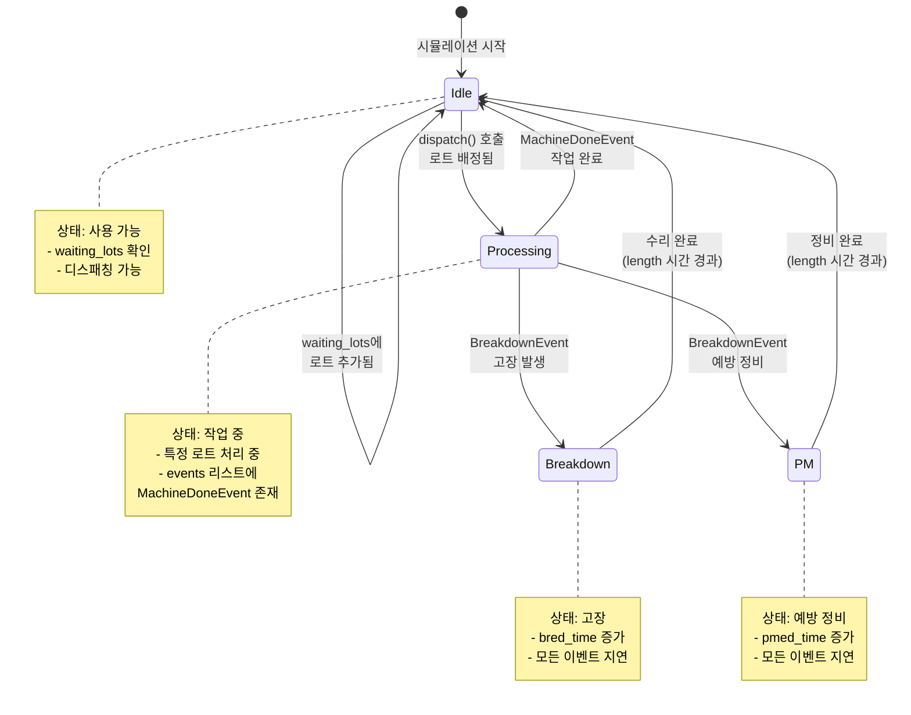
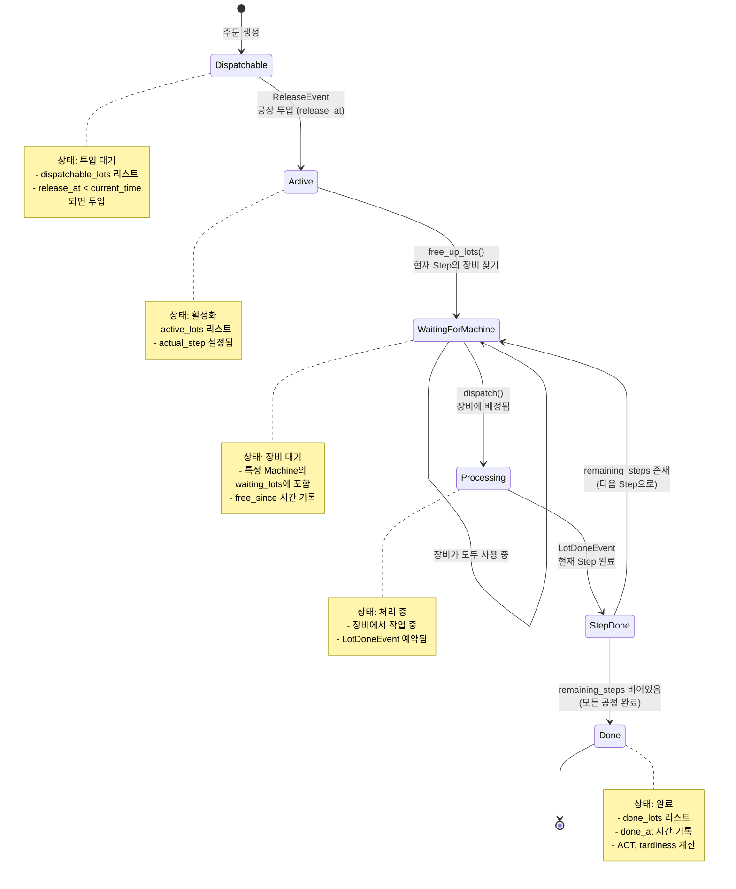
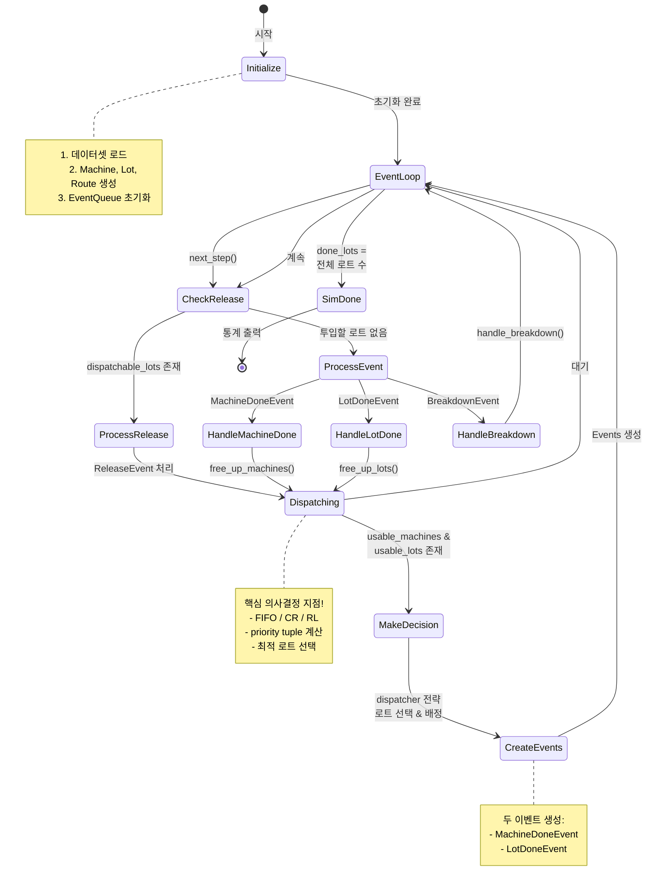
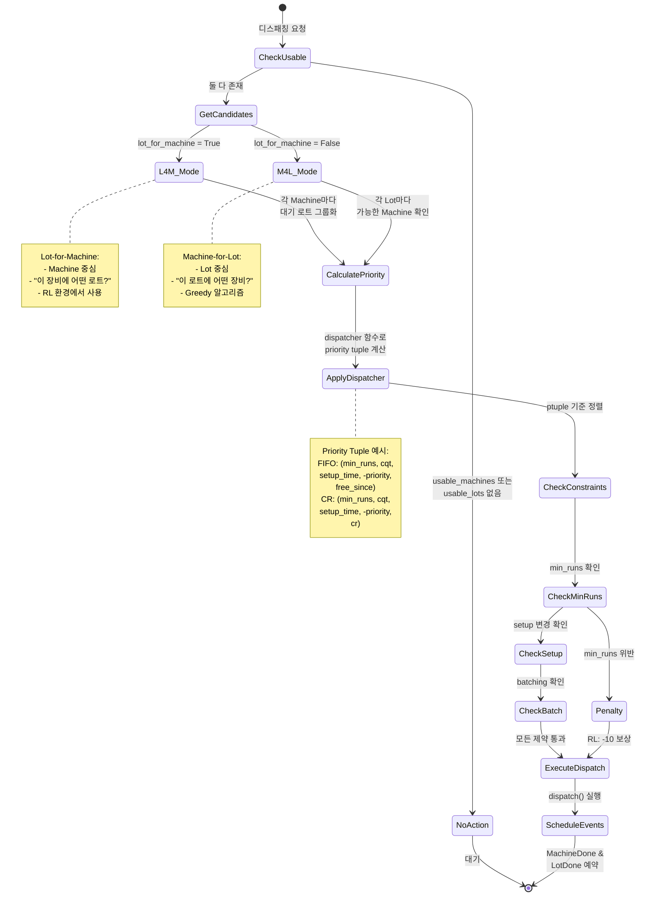
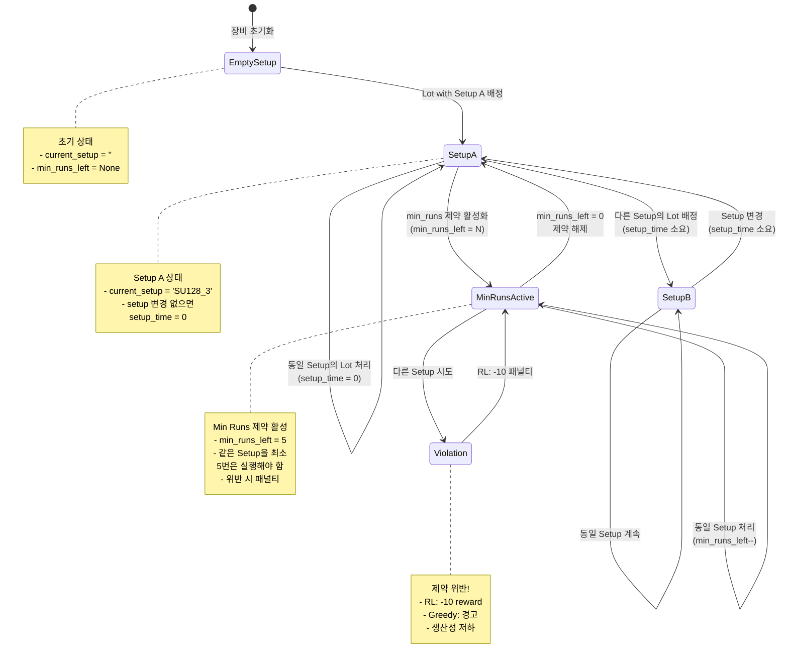
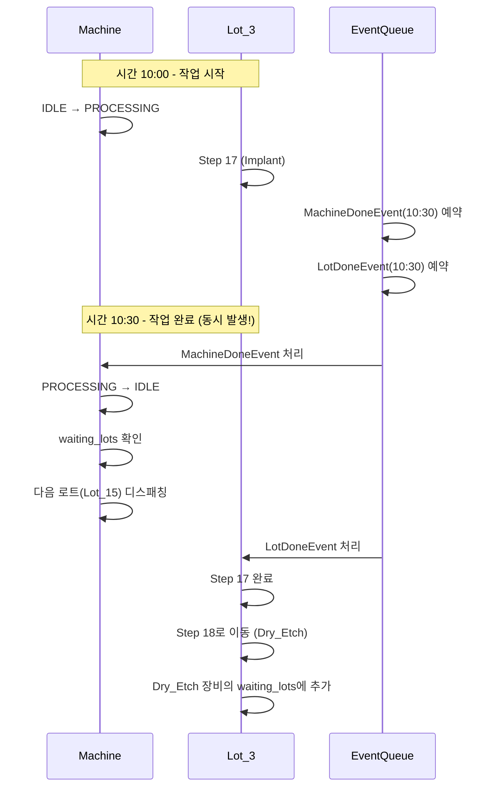
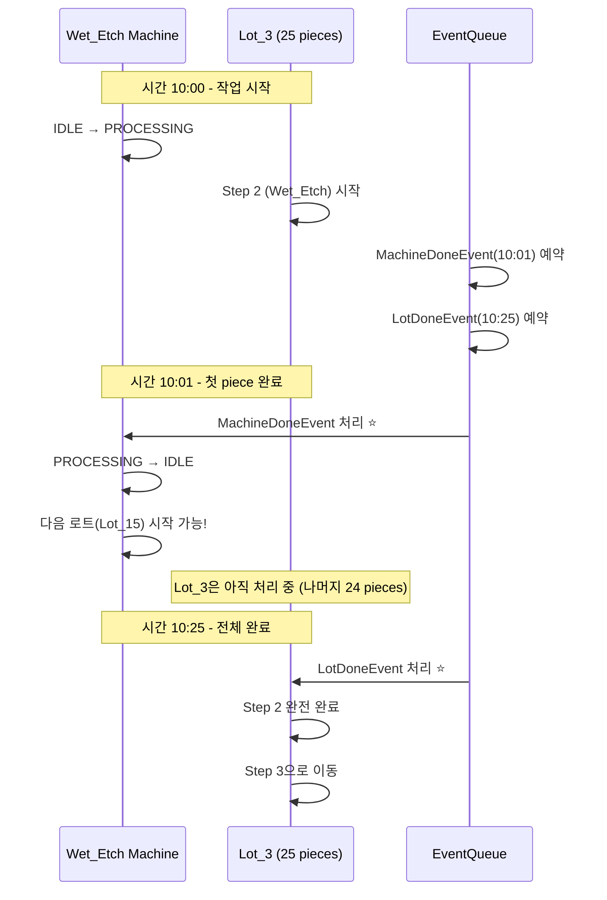
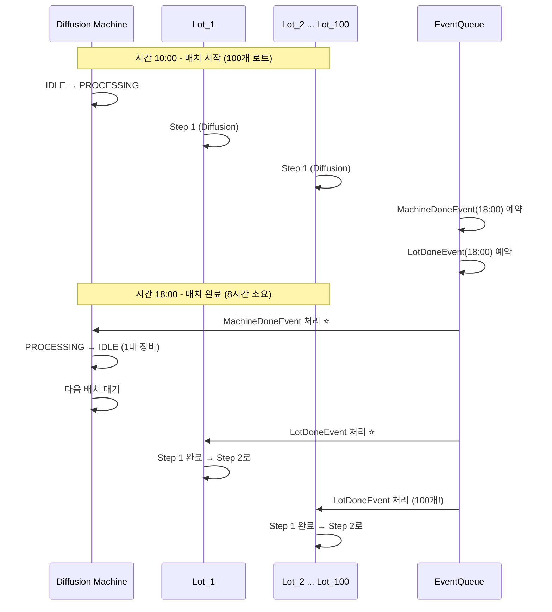

# 🏭 PySCFabSim State Diagrams

## 1️⃣ Machine (장비) State Diagram

**설명:** 장비의 상태 전환을 보여줍니다. 장비는 Idle(유휴) → Processing(작업중) → Idle 또는 Breakdown/PM(고장/정비) 상태로 전환됩니다.

> 💡 **핵심:** MachineDoneEvent가 Processing → Idle 전환을 트리거합니다.
> 장비가 Idle 상태가 되면 waiting_lots에 있는 다음 로트를 디스패칭할 수 있습니다.

---

## 2️⃣ Lot (로트) State Diagram

**설명:** 로트의 생명주기를 보여줍니다. 로트는 투입 대기 → 활성화 → 장비 대기 → 처리 → 다음 단계 또는 완료로 진행됩니다.

> 💡 **핵심:** LotDoneEvent가 현재 Step 완료를 트리거합니다.
> remaining_steps가 남아있으면 다음 Step으로, 없으면 완전히 완료됩니다.

---

## 3️⃣ 전체 이벤트 흐름 Diagram

**설명:** 시뮬레이션의 메인 루프입니다. ReleaseEvent → Dispatching → MachineDone/LotDone 이벤트가 순환하며 시뮬레이션이 진행됩니다.

> 💡 **핵심:** next_step()이 다음 의사결정 지점까지 시뮬레이션을 진행시킵니다.
> usable_machines와 usable_lots가 모두 존재할 때 디스패칭이 발생합니다.

---

## 4️⃣ 디스패칭 의사결정 Diagram

**설명:** 디스패칭 과정에서 어떻게 로트를 선택하는지 보여줍니다. L4M(Lot-for-Machine)과 M4L(Machine-for-Lot) 두 가지 모드가 있습니다.

> 💡 **핵심:** dispatcher 전략(FIFO, CR, RL)이 priority tuple을 계산하고,
> 가장 우선순위가 높은 로트를 선택합니다. 제약사항 위반 시 패널티가 발생합니다.

---

## 5️⃣ Setup 상태 전환 Diagram

**설명:** 장비의 Setup 설정이 어떻게 변경되는지 보여줍니다. Setup 변경 시 setup_time이 소요되며, min_runs 제약이 있을 수 있습니다.

> 💡 **핵심:** Setup 변경은 비용(setup_time)이 발생합니다.
> min_runs 제약이 있을 때 다른 Setup으로 변경하면 패널티가 발생하므로,
> 가능한 같은 Setup의 로트를 연속으로 처리하는 것이 유리합니다.

---

## 6️⃣ MachineDoneEvent vs LotDoneEvent 비교

**설명:** 두 이벤트의 차이를 시간 순서로 보여줍니다.

### 📊 일반 케이스 (Cascading 없음)

### 🔄 Cascading 케이스 (파이프라인)

### 📦 Batching 케이스 (배치)

> 💡 **핵심 차이:**
> - **MachineDoneEvent**: 장비 관점 - "장비가 다시 사용 가능해요"
> - **LotDoneEvent**: 로트 관점 - "로트가 다음 단계로 가요"
> - **일반**: 두 이벤트가 동시 발생
> - **Cascading**: MachineDone이 먼저, LotDone이 나중
> - **Batching**: 1개 MachineDone, 여러 개 LotDone

---

## ✅ State Diagrams 요약

위 다이어그램들은 PySCFabSim의 핵심 동작 원리를 보여줍니다:

1. **Machine State**: 장비는 Idle/Processing/Breakdown/PM 상태를 순환
2. **Lot State**: 로트는 Dispatchable → Active → Waiting → Processing → Done 흐름
3. **Event Flow**: ReleaseEvent → Dispatching → MachineDone/LotDone 반복
4. **Dispatching**: L4M/M4L 모드에서 priority tuple로 최적 로트 선택
5. **Setup**: Setup 변경 비용과 min_runs 제약 관리
6. **Event 비교**: MachineDone(장비 중심) vs LotDone(로트 중심)

---

**마지막 업데이트:** 2025-11-18
